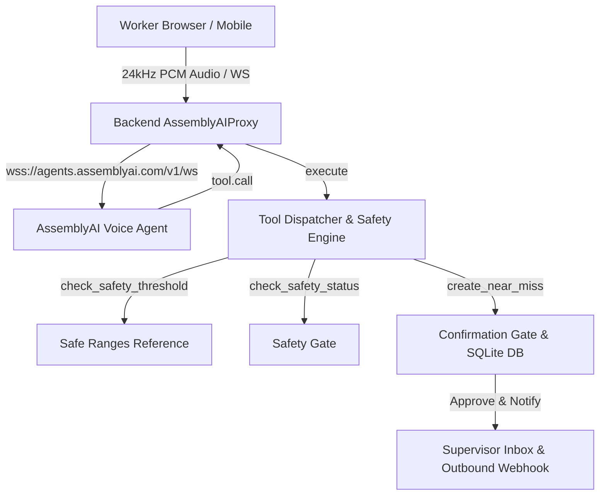

# Aura Field Safety Co-Pilot

> Hands-free voice AI safety co-pilot for frontline industrial technicians, built on the **AssemblyAI Voice Agent API**.

[](https://www.assemblyai.com/)
[](LICENSE)
[](https://www.python.org/)
[](https://react.dev/)

---

## 🌟 Overview & Problem Statement

**The Problem:** Frontline field technicians (mechanics, plant operators, field engineers) work with heavy gloves and physical equipment. When a safety anomaly occurs or a procedure step is performed, forcing workers to take off PPE and manually fill out multi-field software forms leads to massive underreporting of near-misses and high incident risks.

**The Solution:** **Aura** is an intelligent, hands-free voice co-pilot. Powered by AssemblyAI's real-time Voice Agent WebSocket API (`wss://agents.assemblyai.com/v1/ws`), Aura guides workers step-by-step through technical manuals, continuously checks spoken readings against safety threshold boundaries, immediately interrupts on danger readings, and collects near-miss reports without requiring typed input.

---

## 🚀 Live Demo & Quick Start

* **Public Live Demo:** `LIVE_DEMO_URL` *(Deploy on Render or Web Container using `ENV=production`)*
* **5-Minute Shot List:** See [`docs/DEMO-SCRIPT.md`](docs/DEMO-SCRIPT.md)

### Local Development Setup

1. **Clone & Install Python Dependencies:**
   ```bash
   git clone https://github.com/rwilliamspbg-ops/AURA-FIELD-SAFETY-CO-PILOT.git
   cd AURA-FIELD-SAFETY-CO-PILOT
   pip install -r requirements.txt
   ```

2. **Configure Environment (`.env`):**
   ```env
   ASSEMBLYAI_API_KEY=aai_your_api_key_here
   ENV=development
   JWT_SECRET=aura-dev-jwt-secret
   PORT=10000
   ```

3. **Build Frontend & Run Backend:**
   ```bash
   cd frontend && npm ci && npm run build && cd ..
   python3 -m backend.app
   ```
   Open `http://localhost:10000/worker` in your browser.

---

## 🎬 10-Step Product Loop (Copy-Paste Demo Script)

To run the complete closed safety loop in under 5 minutes:

1. **Open Worker View:** Navigate to `/worker` on mobile or desktop browser.
2. **Start Session:** Tap **Start Voice Session**. Aura greets by voice: *"Aura here. I can walk you through a procedure or take a near-miss report hands-free. What do you need?"*
3. **Trigger Procedure:** Say: `"Walk me through the coolant flush."`
4. **Step Guidance:** Aura reads step 1 (*"Inspect secondary coolant line connections for leaks"*) and waits for worker confirmation.
5. **Spoken Anomaly & Barge-In:** Say: `"Pressure is 15 PSI."`
6. **Safety Alert Interrupt:** Aura immediately calls `check_safety_threshold`, flushes audio playback queue, speaks a warning (*"15 PSI exceeds safe operating range of 4.0 - 10.0 PSI"*), shows the red safety banner, and blocks procedure progression.
7. **Transition to Near-Miss:** Say: `"Line is clear, report a near miss."`
8. **Safety Clearance Gate:** Aura executes `check_safety_status`. Once verified clear, it asks adaptive questions (*"What equipment and location were involved?"*).
9. **Read-Back & Confirmation:** Worker answers; Aura reads back the full summary and requires explicit confirmation. Worker says: `"Confirm, file it."` Aura executes `create_near_miss` with a SHA-256 idempotency key.
10. **Supervisor Review & Outbound Alert:** Open `/inbox`, view the report with `SAID` / `INFERRED` / `CONFIRMED` provenance badges, click **Approve**, and dispatch outbound notification to Slack (`SLACK_WEBHOOK_URL`).

---

## ⚡ How AssemblyAI Technology is Applied

Aura leverages AssemblyAI's **Voice Agent API** (`wss://agents.assemblyai.com/v1/ws`) as its central voice spine:

- **Full-Duplex WebSockets (`AssemblyAIProxy`):** The backend maintains a direct WebSocket connection to AssemblyAI, streaming 24kHz PCM16 audio captured via browser `AudioWorklet`.
- **Custom Keyterms & Transcription Tuning:** Custom domain vocabulary (`PSI`, `coolant flush`, `hydraulic`, `lockout`, `tagout`, `valve`, `Aura`) and industrial field prompts improve transcription accuracy in noisy environments.
- **Near-Field Audio Focus:** Configured with `voice_focus: "near-field"` and tuned turn detection (`vad_threshold: 0.5`, `interruption_delay: 200ms`, `silence_duration_ms: 500ms`).
- **Alba Voice & Function Calling:** Uses AssemblyAI's `alba` voice and standard function definitions (`type: "function"`) mapped directly to `packages/contracts/tools.schema.json`.
- **Tool Execution Timing:** On `tool.call`, Aura executes the requested tool in python, returns `tool.result` to AssemblyAI, and flushes speech on safety alerts upon `reply.done`.

---

## 🛡️ Safety Differentiators & Architecture



- **Safety Status Gate (`check_safety_status`):** Refuses report intake while a worker is exposed to an active hazard.
- **Confirmation Gate:** Database writes (`create_near_miss`, `log_maintenance_entry`) strictly require explicit worker voice/text confirmation (`confirmation_status == CONFIRMED`).
- **Idempotency Guarantee:** Deduplication key `SHA256(worker_id:site:equipment:normalized_narrative:local_day)` prevents duplicate reports upon reconnects or repeated calls.
- **Data Provenance:** Tracks whether fields were explicitly spoken (`SAID`), computed (`INFERRED`), or confirmed (`CONFIRMED`).

---

## 🔬 Honest Limitations

- **Procedure Knowledge Base:** Uses offline TF-IDF manual indexing (`data/indexes/manual_index.json`) rather than full vector database embeddings.
- **Storage Layer:** Uses local SQLite (`aura.db`) suitable for single-instance demo deployments.
- **Enterprise ERPs:** Salesforce (`integrations/salesforce.py`) and Jira (`integrations/jira.py`) are provided as explicit integration stubs labeled `STUB`.

---

## 🧪 Testing & Verification

Run the full automated unittest suite:
```bash
python3 -m unittest qa/test_qa_suite.py
```

Run frontend build check:
```bash
cd frontend && npm run build
```

---

## ⚙️ Environment Variables Reference

| Name | Purpose | Production Default |
|---|---|---|
| `ASSEMBLYAI_API_KEY` | AssemblyAI API Key | *(Required)* |
| `ENV` | Environment mode (`development` / `production`) | `production` |
| `JWT_SECRET` | Secret key for JWT signing | *(Required custom secret)* |
| `PORT` | HTTP server port | `10000` |
| `FRONTEND_ORIGIN` | CORS allowed origin | Deployed Web URL |
| `SLACK_WEBHOOK_URL` | Webhook URL for outbound safety notifications | Optional |
